<div align="center">

# AI Workflow Builder

**Build agents with visual workflows, RAG, tools, and multi-model orchestration.**

轻量版 AI Agent 编排平台 · 对标 Dify / Coze 核心能力 · 完整 MVP 闭环

[](https://www.python.org/)
[](https://fastapi.tiangolo.com/)
[](https://vuejs.org/)
[](https://www.mysql.com/)
[](LICENSE)

[产品概览](#-产品概览) · [演示](#-demo) · [系统架构](#-系统架构) · [核心能力](#-核心能力) · [快速开始](#-快速开始) · [详细文档](#-详细文档)

</div>

## 🧭 产品概览

AI Workflow Builder 是一个**前后端分离**的全栈 Web 应用，覆盖 Agent 应用开发平台的核心链路：

```
对话交互 ──▶ 可视化编排 ──▶ 知识库注入 ──▶ 工具调用 ──▶ 多模型推理 ──▶ 执行监控
```

| 定位 | 说明 |
|------|------|
| 🎯 产品形态 | 类 Dify / Coze 的轻量 MVP，可独立演示完整闭环 |
| 🧩 核心差异 | 自研 **DAG 工作流执行引擎** + 用户级 **多模型配置中心** + **Token 预算分配** |
| 🔌 模型接入 | OpenAI 兼容 API · 支持千问 / DeepSeek / GPT / Claude |
| 📡 实时能力 | Chat / Workflow 双通道 **SSE 流式推送**，节点状态与 Trace 可观测 |

> 当前版本 **v0.1.0** · 完整代码与接口细节见 [`details`](https://github.com/L13653521916/AI-Workflow-Builder/tree/details) 分支

## 📸 Demo

以下截图均来自**真实本地 Run**，展示从登录到工作流执行的完整产品路径。

### ① 登录与认证

**模块定位**：统一身份入口，为 Chat / Canvas / Knowledge / Tools / Models 五个主模块提供 JWT 鉴权基础。

| 核心能力 | 实现要点 |
|----------|----------|
| 用户注册 / 登录 | bcrypt 密码哈希 · 邮箱格式校验 |
| JWT 鉴权 | `Authorization: Bearer` · Token 持久化 localStorage |
| 路由守卫 | 未登录跳转 `/login` · 已登录自动恢复 `/auth/me` |
| 视觉设计 | 全屏背景 + 毛玻璃卡片 · Element Plus 表单 |

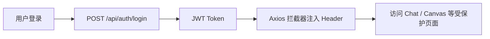
<div align="center"><br/><sub><b>Login</b> · 注册 / 登录 / JWT · 路由守卫 · 会话恢复</sub></div>

### ② AI 对话

**模块定位**：独立 Chat 工作台，支持多轮对话与 SSE 流式输出，可作为 Agent 快速验证入口。

| 核心能力 | 实现要点 |
|----------|----------|
| 多轮对话 | Conversation + Message 持久化至 MySQL |
| SSE 流式 | `text/event-stream` · 逐 token 渲染 |
| Markdown | marked + highlight.js 代码高亮 |
| 会话管理 | 左侧历史列表 · 新建 / 切换对话 |

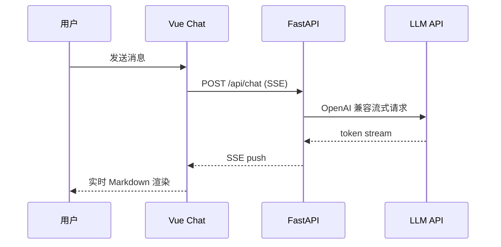
<div align="center">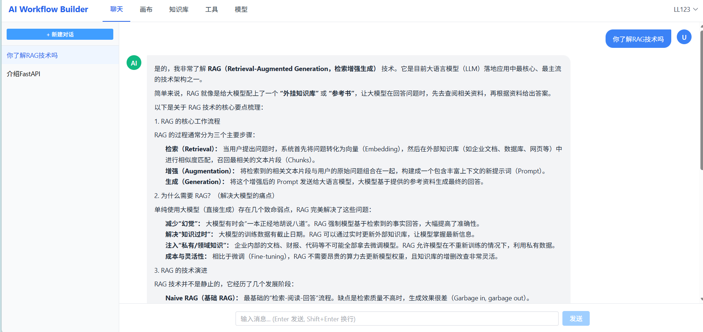<br/><sub><b>Chat</b> · 多轮对话 · SSE 流式 · Markdown 渲染 · 历史持久化</sub></div>

### ③ 可视化工作流编排

**模块定位**：产品核心——基于 **Vue Flow** 的可视化 Agent 编排画布，支持 6 类节点拖拽、连线与动态配置。

**画布布局**
```
┌──────────────┬────────────────────────────┬──────────────┐
│  NodePalette │      WorkflowCanvas        │ NodeConfig   │
│  节点面板     │   Vue Flow 拖拽 / 连线      │  动态表单     │
└──────────────┴────────────────────────────┴──────────────┘
                              │ ExecutionLog (底部)
```

| 类型 | 标识 | 分类 | 说明 |
|------|------|------|------|
| 起始 | `start` | 流程控制 | 工作流入口，定义输入参数 |
| 输出 | `end` | 流程控制 | 格式化最终输出（Text / MD / JSON） |
| 条件判断 | `condition` | 流程控制 | if/else 双分支 |
| LLM 推理 | `llm` | AI 节点 | 调用用户配置的模型，支持 Prompt 模板 |
| RAG 检索 | `rag` | AI 节点 | 从知识库检索 Top-K 片段 |
| 工具调用 | `tool` | 工具 | 调用内置 / 自定义 Tool Handler |

**典型链路**：`起始 → RAG 检索 → LLM 推理 → 输出`

<div align="center">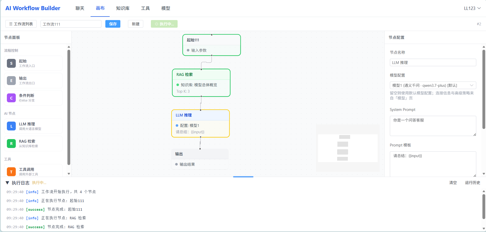<br/><sub><b>Canvas</b> · Vue Flow 画布 · 6 类节点 · RAG+LLM 链路 · 节点级配置面板</sub></div>

### ④ 工作流执行与监控

**模块定位**：自研 **DAG 执行引擎**（`workflow_executor.py`），按拓扑序调度节点，SSE 实时推送状态，支持 Trace 级可观测。

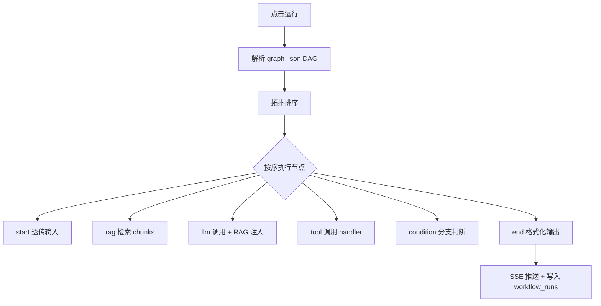

| 监控能力 | 说明 |
|----------|------|
| 节点高亮 | 🟡 执行中 · 🟢 成功 · 🔴 失败 |
| 执行日志 | 时间线 + 点击定位节点 |
| 节点输出 | 右侧面板展示中间 / 最终输出 |
| 模型 Trace | 配置名 · 延迟 · Agent 模式 · RAG 注入段数 · Token 用量 |
| 运行历史 | `workflow_runs` 表持久化，支持回溯 |

<div align="center">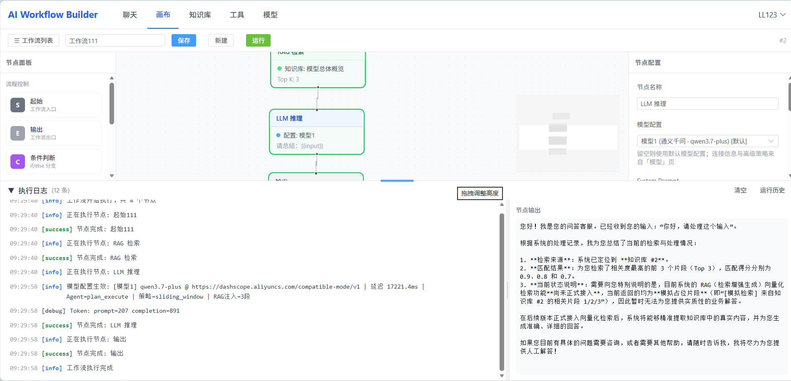<br/><sub><b>Execution</b> · DAG 调度 · SSE 实时日志 · Trace 追踪 · 运行历史</sub></div>

### ⑤ 知识库管理

**模块定位**：为 RAG 节点提供文档数据源，支持多格式上传与知识库 CRUD，与工作流画布联动。

| 核心能力 | 实现要点 |
|----------|----------|
| 知识库 CRUD | 创建 / 管理 / 删除 · 文档计数 |
| 文档上传 | PDF / TXT / MD · `multipart/form-data` |
| 本地存储 | `uploads/` 目录 · 元数据写入 MySQL |
| RAG 联动 | 画布 RAG 节点下拉选择知识库 · Top-K / 阈值配置 |

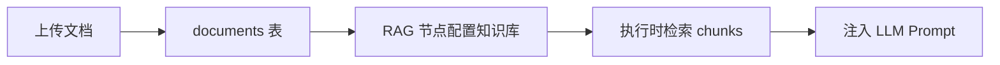
<div align="center">
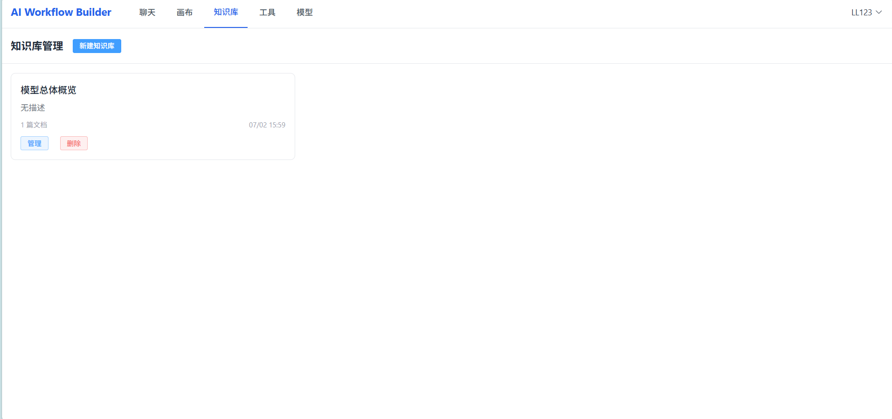
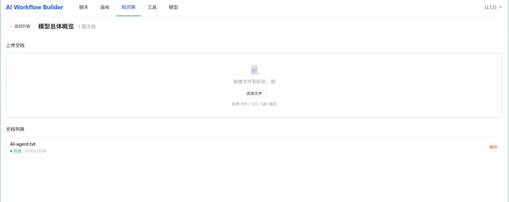
<br/><sub><b>Knowledge Base</b> · 多格式上传 · 知识库 CRUD · RAG 节点联动</sub>
</div>

### ⑥ 工具与模型配置

**模块定位**：Agent 的「能力层」——工具市场提供可调用 Handler，模型中心统一管理多提供商 LLM 连接与运行时策略。

| 工具 | Handler | 分类 | 功能 |
|------|---------|------|------|
| web_search | web_search | search | 模拟互联网搜索 |
| code_exec | code_exec | code | Python 沙箱执行（15s 超时） |
| http_request | http_request | api | HTTP GET/POST |
| json_parse | json_parse | data | JSON 解析验证 |
| text_split | text_split | text | 文本拆分 |
| string_replace | string_replace | text | 字符串替换 |
| regex_match | regex_match | text | 正则匹配 |
| text_length | text_length | text | 文本统计 |
| current_time | current_time | utility | 系统时间 |

**模型配置优先级**：`节点 modelProfileId` → `用户默认配置` → `config.py 服务端默认`

| 提供商 | 标识 | 说明 |
|--------|------|------|
| 通义千问 | `qianwen` | 阿里云百炼 OpenAI 兼容接口 |
| DeepSeek | `deepseek` | 官方 API |
| OpenAI GPT | `gpt` | 官方 API |
| Claude | `claude` | 需兼容代理网关 |
| 自定义 | `custom` | 自行填写 Base URL |

<div align="center">
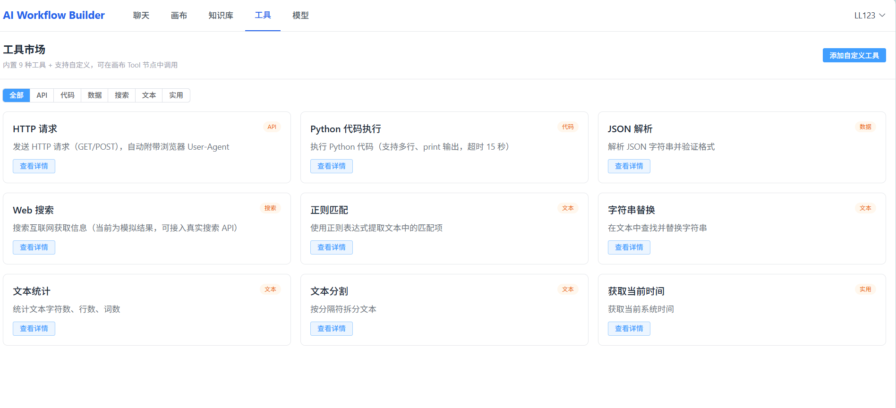
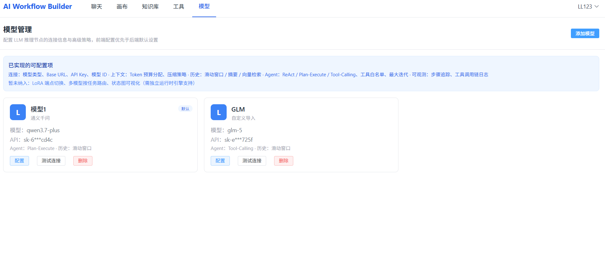
<br/><sub><b>Tools & Models</b> · 9 内置工具 + 自定义 · 多提供商 · Token 预算 · 连接测试</sub>
</div>

## 🏗 系统架构

#### 整体分层
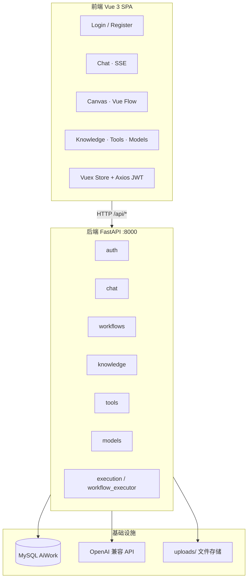

#### 技术栈

| 层级 | 技术选型 |
|------|----------|
| 前端框架 | Vue 3 · TypeScript · Vite 6 |
| 状态 / 路由 | Vuex 4 · Vue Router 4 |
| UI / 样式 | Element Plus · Tailwind CSS |
| 画布引擎 | Vue Flow (@vue-flow/core) |
| 流式通信 | SSE（Chat + Workflow 双通道） |
| 后端框架 | FastAPI · SQLAlchemy 2 |
| 数据库 | MySQL 8 |
| 认证 | JWT（python-jose）+ bcrypt |
| AI 运行时 | OpenAI 兼容客户端 · 自研 model_runtime |

#### 数据模型（核心表）

| 表名 | 用途 |
|------|------|
| `users` | 用户账号 |
| `conversations` / `messages` | 聊天会话与消息 |
| `workflows` | 工作流定义（`graph_json` 存 DAG） |
| `knowledge_bases` / `documents` | 知识库与文档 |
| `tools` | 内置 + 自定义工具 |
| `model_profiles` | 多模型配置（含 `config_json` 策略） |
| `workflow_runs` | 执行记录 · 日志 · 输出 |

#### 工作流 graph_json 结构

```json
{
  "nodes": [{ "id": "node_xxx", "type": "llm", "config": { "modelProfileId": 1, "prompt": "请总结：{{input}}" } }],
  "edges": [{ "source": "node_start", "target": "node_rag" }, { "source": "node_rag", "target": "node_llm" }]
}
```

## ✨ 核心能力总览

| 模块 | 能力 | 技术亮点 |
|------|------|----------|
| 🔐 认证 | 注册 / 登录 / JWT / 路由守卫 | bcrypt · Axios 拦截器 · `/auth/me` 会话恢复 |
| 💬 聊天 | 多轮对话 · SSE 流式 · Markdown | Conversation 持久化 · highlight.js |
| 🎨 画布 | 6 类节点 · 拖拽连线 · CRUD | Vue Flow · 动态 NodeConfigPanel |
| 📚 知识库 | CRUD · PDF/TXT/MD 上传 | 本地存储 · RAG 节点 Top-K 配置 |
| 🔧 工具 | 9 内置 + 自定义 · 在线测试 | tool_handlers · Tool 节点联动 |
| 🤖 模型 | 多提供商 · API Key · 高级策略 | model_runtime · Token 预算 · Trace |
| ⚡ 执行 | 一键运行 · SSE · 运行历史 | DAG 拓扑调度 · workflow_runs 持久化 |

## 🚀 快速开始

**环境要求**：Python 3.10+ · Node.js 18+ · MySQL 8.0+

```bash
# 后端
cd Be_end && pip install -r requirements.txt
uvicorn main:app --reload --port 8000

# 前端
cd Front_end && npm install && npm run dev
```

访问 `http://localhost:5173`，Vite 将 `/api` 代理至 `http://localhost:8000`。

**推荐体验路径**：注册登录 → 模型页配置并测试 → 知识库上传文档 → 画布搭建 RAG+LLM 链路 → 查看执行 Trace

## 📖 详细文档

完整模块说明、数据库设计、API 接口与执行引擎细节，请查看 [`details` 分支](https://github.com/L13653521916/AI-Workflow-Builder/tree/details)。

## 📬 联系

如有问题或合作意向，欢迎通过 [GitHub Issues](https://github.com/L13653521916/AI-Workflow-Builder/issues) 联系。

<div align="center">**⭐ 如果这个项目对你有帮助，欢迎 Star 支持一下！**</div>
